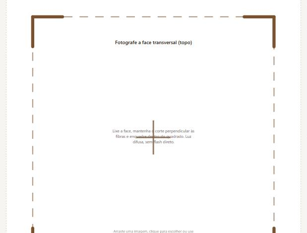
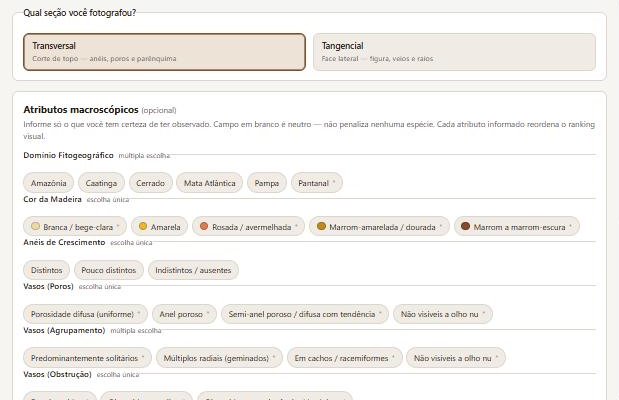

# XiloScan

**Fotografe o corte de uma peça de madeira e descubra de que espécie ela é.**
Reconhecimento visual por *embedding* (ArcFace) + busca vetorial (FAISS) sobre o
catálogo de 271 madeiras brasileiras do LPF/Serviço Florestal Brasileiro, com um
filtro por caracteres anatômicos que reordena o ranking quando o perito informa o
que vê na lupa.

[](https://github.com/danilogep/XiloScan/actions/workflows/ci.yml)
[](#testes)
[](https://python.org)
[](LICENSE)

> **Uso auxiliar.** A identificação macroscópica de madeira exige confirmação por
> profissional habilitado. Não use isoladamente para fins periciais, fiscalizatórios
> ou legais.

<table>
<tr>
<td width="33%"></td>
<td width="33%"></td>
<td width="33%"></td>
</tr>
<tr>
<td><b>1. Entrada</b><br>Cadastro self-service, aviso de uso auxiliar em primeiro plano.</td>
<td><b>2. Captura guiada</b><br>A moldura desenha o corte central de 85% que o backend vai usar, com régua de escala. O quality check reprova a foto antes de gastar inferência.</td>
<td><b>3. Atributos (opcional)</b><br>Vocabulário controlado do MCB. Campo em branco é neutro — não penaliza espécie alguma. O <code>*</code> marca termo ainda não conferido contra o glossário.</td>
</tr>
</table>

> Falta aqui a tela de resultado — ranking com índice de confiança, comparação lado a
> lado e divergências campo a campo. A inferência com TTA pede cerca de 1 GB de RAM
> livre, que a máquina destas capturas não tinha; a captura entra assim que houver um
> treino rodado (ver [Desempenho do modelo](#desempenho-do-modelo)).

---

## Desempenho do modelo

| Métrica | Valor |
|---|---|
| recall@1 (busca de cosseno contra o restante do índice) | **[MEDIR]** |
| recall@5 | **[MEDIR]** |
| margem média entre o 1º e o 2º colocado | **[MEDIR]** |

Esses três números saem de `backend/scripts/train.py`, que já os calcula e grava ao
lado do checkpoint — **mas nenhum treino foi versionado ainda**, então não há valor
medido a reportar. Preencher a tabela é uma execução:

```bash
python -m backend.scripts.train --epochs 40 --batch-size 24
```

O protocolo está fixo no script: recall@1 por cosseno contra o resto do índice,
medido nas espécies com ≥3 fotos — as únicas que têm imagem de validação. Até lá,
qualquer número aqui seria invenção, e a tabela fica marcada.

### O que *está* medido

A qualidade do **dataset** é verificada a cada recoleta por `scraper/relatorio.py`:

```
espécies  : 271   falhas: 0

  nome científico    271/271   100.0%        densidade básica    268/271    98.9%
  família            271/271   100.0%        propriedades (≥20)  270/271    99.6%
  nomes populares    271/271   100.0%        imagem baixada      263/271    97.0%
  local de coleta    270/271    99.6%        grã                 252/271    93.0%
  cor (descrição)    237/271    87.5%        textura             253/271    93.4%
  anéis (código MCB) 254/271    93.7%        cor (código MCB)    238/271    87.8%

RESULTADO: OK — todos os campos críticos preenchidos.
```

213 espécies têm foto de seção de corte utilizável (893 imagens no total), e a
distribuição é dura: **112 espécies têm apenas 2 imagens.** É essa escassez que
dita as duas decisões centrais do modelo — metric learning em vez de classificação
e TTA por rotação na construção do índice.

---

## Stack

| Camada | Escolha | Por quê |
|---|---|---|
| Embedding | PyTorch + timm (EfficientNet-B4) + **ArcFace** | 1–2 fotos por espécie: aprender um espaço métrico generaliza onde um softmax de 271 classes não tem amostra |
| Busca | **FAISS** `flat_ip` sobre vetores L2-normalizados | 271 espécies cabem em busca exata; o caminho `ivf_pq` já está pronto para quando entrarem dezenas de milhares |
| Pré-processamento | OpenCV — white balance, CLAHE na luminância, corte central 85% | foto de campo chega com luz amarela de oficina; sem normalizar, a cor domina o embedding |
| API | FastAPI + Pydantic v2 | contrato tipado, documentação automática |
| Interface | React 18 + TypeScript + Vite (PWA) | roda no celular, com guia de enquadramento e comparação lado a lado |
| Dados | Scraper próprio sobre o LPF + camada MCB | ver [arquitetura de dados](docs/arquitetura-de-dados.md) |
| Deploy | Docker + Railway | ver [guia de deploy](docs/DEPLOY_RAILWAY.md) |

---

## Rodando

```bash
git clone https://github.com/danilogep/XiloScan.git
cd XiloScan

python -m venv .venv && .venv/Scripts/activate      # Linux/macOS: source .venv/bin/activate
pip install -r backend/requirements.txt

python scripts/download_dataset.py                  # catálogo + imagens (não vão no git)
python -m backend.scripts.build_index --augment 8   # embeddings + índice FAISS
uvicorn backend.app.main:app --reload               # http://127.0.0.1:8000/docs
```

Em outro terminal:

```bash
cd frontend && npm install && npm run dev           # http://127.0.0.1:5173
```

Sem checkpoint treinado o índice é construído sobre features ImageNet — funciona
para desenvolver, não para identificar de verdade. O script avisa.

<details>
<summary>Com Docker</summary>

```bash
docker build -t xiloscan .
docker run -p 8000:8000 -v "$PWD/data:/app/data" xiloscan
```
</details>

---

## Como funciona, em três movimentos

**1. Dataset com proveniência por campo.** O site do LPF e o app *Madeiras Comerciais
do Brasil* publicam conjuntos de campos **diferentes** — o LPF tem propriedades
mecânicas e local de coleta, o MCB tem vasos, parênquima e raios. Cada espécie do
`dataset_lpf.json` carrega `proveniencia: {lpf, mcb}` e um `completeness`, e o filtro
híbrido usa esse número para **não punir uma espécie por uma lacuna nossa**.
→ [docs/arquitetura-de-dados.md](docs/arquitetura-de-dados.md)

**2. Embedding + busca, não classificação.** ArcFace sobre EfficientNet-B4, GeM
pooling, TTA por rotação na indexação (a maioria das espécies tem uma única foto
oficial, e sem TTA o índice teria um vetor por classe e nenhuma tolerância a
orientação). Agregação por espécie no FAISS: o ranking é de espécies, não de fotos.
→ [docs/modelo-e-busca.md](docs/modelo-e-busca.md)

**3. Filtro híbrido, não substituição do perito.** O score visual é combinado com os
atributos anatômicos que o usuário marca (`peso_visual = 0.70`), e a API devolve
`top1_ambiguo` quando a diferença para o segundo colocado é menor que 0.05 — caso em
que a interface **exige** comparação visual antes de concluir. A tela mostra as
divergências campo a campo, porque um score de 87% sozinho engana: pode vir de um
match visual forte contra atributos que não batem.
→ [docs/frontend.md](docs/frontend.md)

---

## Testes

```bash
python -m pytest                              # 144 testes
python notebooks/sync_notebooks.py --check    # notebooks == repositório?
cd frontend && npx tsc --noEmit && npm run build
```

| Suíte | Testes | O que trava |
|---|---|---|
| parser | 50 | **páginas reais** do LPF como fixtures: dois templates de "Características Gerais", colspan/rowspan, `Aparente` vazio virando `None` e não `0.0` |
| backend | 31 | CLAHE, white balance, TTA, FAISS (agregação por espécie, round-trip, índice inconsistente), ArcFace (a margem reduz o logit da classe correta e deixa as demais intactas), e um **E2E real**: dataset sintético → `build_index` → `/identify` |
| notebooks | 19 | formato do `.ipynb`, nenhum `!python`/`!pip` pelo PATH, `google.colab` sempre sob checagem de ambiente, e as cópias de código em dia com o repositório |
| rede | 16 | classificação de erro de DNS (inclusive `ConnectError(gaierror(-3))`, a forma exata que o httpx entrega) e a regressão do "✔ 0 espécies" que parecia sucesso |
| relatório | 11 | reprova o dataset do parser velho, limiar de 70%, console cp1252 do Windows |
| merge | 8 | conflitos LPF×MCB, validação contra a taxonomia, cálculo de `completeness` |

Os notebooks carregam uma cópia do código nas células `%%writefile`. Depois de editar
qualquer fonte, rode `python notebooks/sync_notebooks.py`; o `--check` do CI falha se
divergirem.

---

## Documentação

| Página | Conteúdo |
|---|---|
| [Arquitetura de dados](docs/arquitetura-de-dados.md) | fontes, merge com proveniência, schema de saída, como refazer o dataset |
| [Modelo e busca](docs/modelo-e-busca.md) | ArcFace, pré-processamento, índice vetorial, filtro híbrido, contrato da API |
| [Frontend](docs/frontend.md) | captura guiada, comparação visual, PWA |
| [Deploy no Railway](docs/DEPLOY_RAILWAY.md) | variáveis, build, persistência |

## Estrutura

```
scraper/      crawler + parser + download + merge, com fixtures de HTML real
backend/app/  config · schemas · catalog · preprocessing · model · index · hybrid · main
backend/scripts/  train.py (ArcFace) · build_index.py (embeddings + FAISS)
frontend/src/ types · api · hooks · components
notebooks/    01_catalogo_lpf · 02_modelo_e_api — autocontidos, rodam no Colab
scripts/      download_dataset.py
data/         mcb_taxonomy.json · mcb_overlay.json (versionados)
              dataset_lpf.json · images/ (baixados, fora do git)
```

## Créditos e licença dos dados

Dados e imagens: **Laboratório de Produtos Florestais / Serviço Florestal Brasileiro**
(<https://lpf.florestal.gov.br>). Vocabulário anatômico: app *Madeiras Comerciais do
Brasil* v1.12.1 — UFS/LAVD + SFB, e base de dados LPF/SFB.

Uso acadêmico, citando a fonte. O scraper respeita rate limit e se identifica no
User-Agent (defina `XILOSCAN_SCRAPER_CONTATO` com um e-mail de contato antes de coletar).

O **código** deste repositório está sob [MIT](LICENSE). Os **dados** seguem a licença
da fonte original e não são redistribuídos aqui.

---

<sub>Parte do meu portfólio — mais projetos em **[github.com/danilogep](https://github.com/danilogep)** · [LinkedIn](https://linkedin.com/in/danilogep)</sub>
